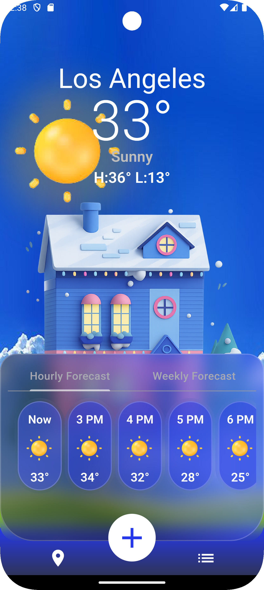
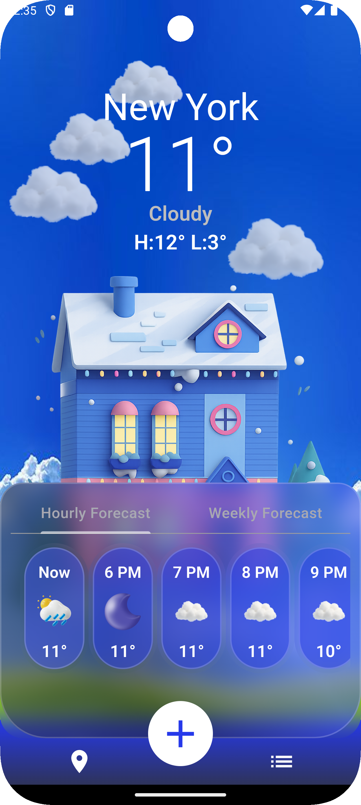
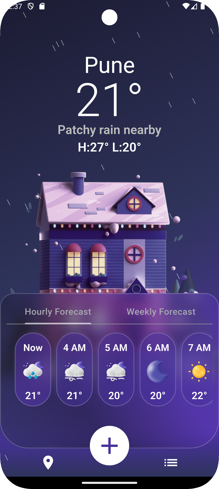
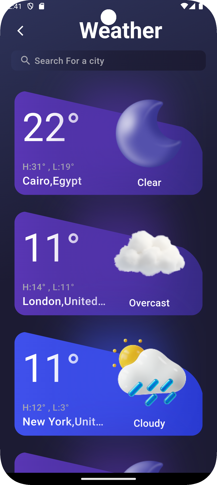
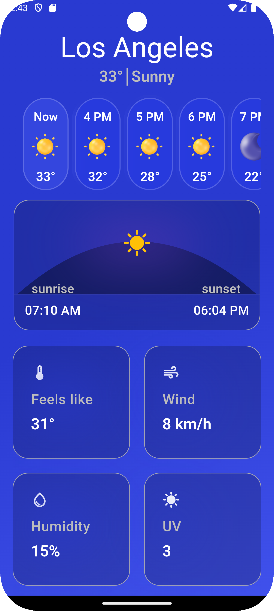

# 🌦️ Weather App

A modern and responsive **Flutter** application that displays real-time weather information with a beautiful and intuitive user interface.

---

## ✨ Features

- 🔍 Search for any city to get live weather data
- 🌡️ Display current temperature, high and low values
- ☁️ Detailed weather info: humidity, pressure, wind, and visibility
- 🌅 Sunrise and sunset visualization
- 🕓 Hourly forecast with dynamic weather icons
- 🎨 Dynamic background that changes between day and night
- 🌙 Fully supports Dark Theme

---

## 🧩 Technologies Used

| Technology       | Purpose                         |
|------------------|---------------------------------|
| **Flutter**      | Cross-platform app development  |
| **Dart**         | Programming language            |
| **HTTP package** | API requests                    |
| **Provider**     | State management                |
| **ScreenUtil**   | Responsive UI design            |
| **WeatherAPI**   | Fetching real-time weather data |

---

## 🖼️ Screenshots

## 🌤️ Weather App Screens

| ☀️ Sunny                                        | 🌙 Night                                          | ☁️ Cloudy                                          | 🌧️ Rainy                                        |
|-------------------------------------------------|---------------------------------------------------|----------------------------------------------------|--------------------------------------------------|
|  |  |  |  |

---

## 🧭 Other Screens

| 🔍 Search                                           | 📊 Details                                                |
|-----------------------------------------------------|-----------------------------------------------------------|
|  |  |

---

## ⚙️ How to Run the App

1. **Clone the repository**
   ```bash
   git clone https://github.com/HabibaTamer9/weather_app.git
2. **Navigate to the project directory**
   ```bash
   cd weather_app
3. **Install dependencies**
   ```bash
   flutter pub get
4. **Install dependencies**
   ```bash
   flutter run
   
---

## 🔑 Notes

**Add your WeatherAPI key inside the API file:**
  ```bash
  const String apiKey = "YOUR_API_KEY_HERE";
